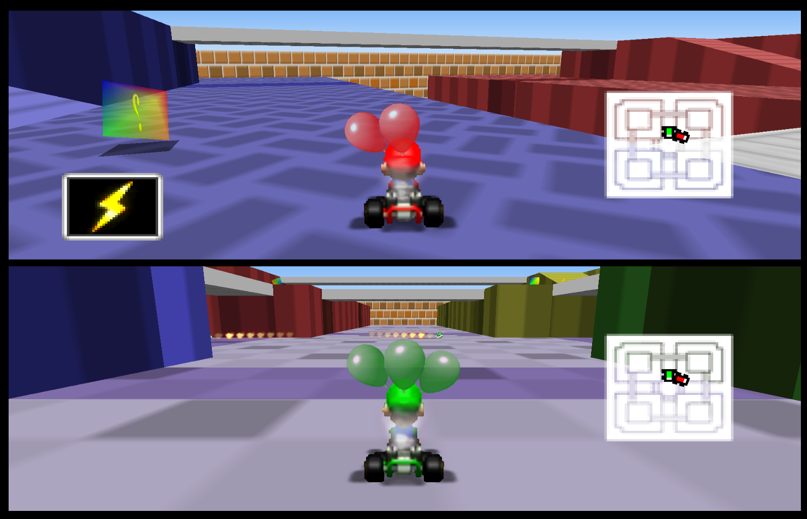
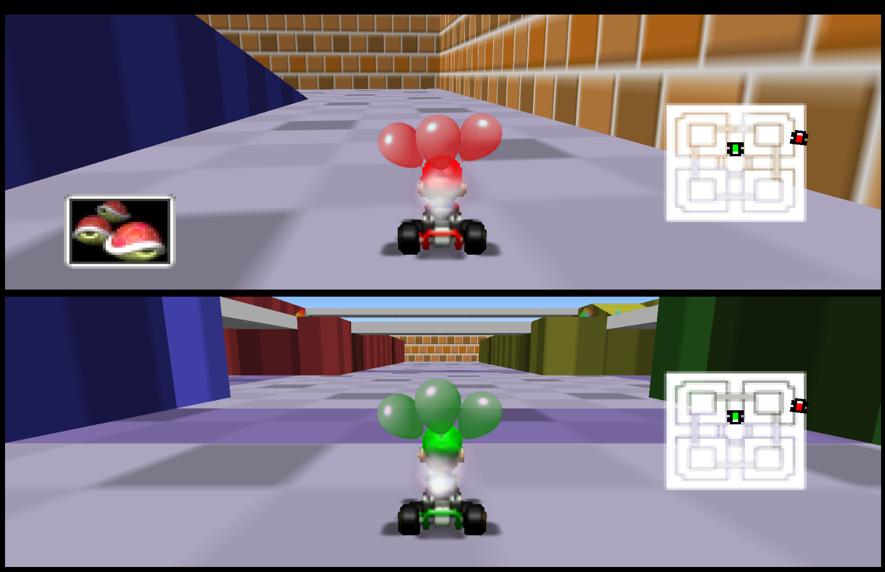
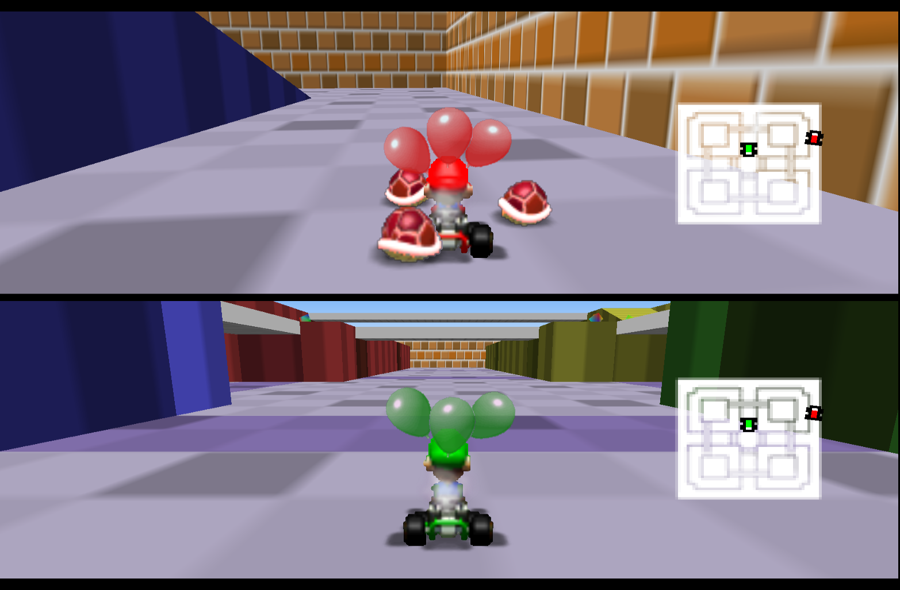

# Mario Kart 64 — Battle Mode Item Curve Patch

## Patch Info

| Field | Value |
|-------|-------|
| Patch file | `mk64_eu_battle_curve.ips` |
| Base ROM | Mario Kart 64 (Europe) PAL (extracted from Wii WAD) |
| ROM size | 12 MB (12,582,912 bytes) |
| Apply with | Lunar IPS, RomPatcher.js, UniPatcher |

---

## What This Patch Does

Modifies the battle mode item probability curve stored in the common data MIO0-compressed block (`ROM 0x132C70`, segment offset `0x8B14`). The 100-slot item table determines the likelihood of each item appearing from an item box.

---

## Item Probabilities

| ID | Item | Vanilla | Patched | Change |
|----|------|--------:|--------:|--------|
| `01` | Single Banana | 10% | 10% | — |
| `02` | Banana Bunch | 5% | 5% | — |
| `03` | Single Green Shell | 5% | 10% | +5% |
| `04` | Triple Green Shell | 20% | 21% | +1% |
| `05` | Single Red Shell | 20% | 16% | −4% |
| `06` | Triple Red Shell | 0% | 10% | ✅ added |
| `08` | Lightning | 0% | 3% | ✅ added (rare) |
| `09` | Fake Item Box | 15% | 10% | −5% |
| `0A` | Invincible Star | 20% | 10% | −10% |
| `0B` | Ghost | 5% | 5% | — |

---

## Screenshots

---

# Patch 2: Lightning → Balloon Loss Only When Squished

| Field | Value |
|-------|-------|
| Patch file | `mk64_eu_blitz_squish_balloon.ips` — lightning change only |
| Complete patch | `mk64_eu_battle_v2_komplett.ips` — item curve + lightning, apply to a clean EU ROM |
| Result ROM | `rom_battle_v2.z64` — curve + lightning, ready to play (CRC recalculated) |
| Note | `rom_blitz_squish.z64` contains ONLY the lightning patch (no item curve), can be deleted |

## Behavior

Before: Lightning in battle mode → all opponents immediately lose a balloon and shrink.
After: Lightning only shrinks. The balloon is lost only when the shrunken opponent gets run over (squished).

## Technical Details (EU v1.1, RAM = ROM + 0x7FFFF400)

| Location | ROM | RAM | Change |
|--------|-----|-----|----------|
| `trigger_lightning_strike`: `jal pop_player_balloon` | 0x8ECDC | 0x8008E0DC | → `nop` (no immediate balloon loss) |
| `apply_lightning_effect`: `jal trigger_squish` | 0x8EDA0 | 0x8008E1A0 | → `jal 0x8008C298` (hook) |
| Code cave (empty UNUSED functions) | 0x8CE98 | 0x8008C298 | if `gModeSelection==3` (battle): `pop_player_balloon(player, idx)`, then always `trigger_squish(player, idx)` |

Key symbols (EU v1.1):

| Symbol | RAM |
|--------|-----|
| `pop_player_balloon` | 0x8006B894 (ROM 0x6C494) |
| `trigger_squish` | 0x8008DA9C (ROM 0x8E69C) |
| `apply_lightning_effect` | 0x8008E0F8 (ROM 0x8ECF8) |
| `gModeSelection` | 0x800DC55C (3 = battle) |
| `gPlayerBalloonCount[8]` (s16) | 0x8018D920 |

Bugfix history: v1 of the patch jumped to 0x8008C27C (delta incorrectly determined as 0x7FFFF3E4, because IDO schedules instructions before the `addiu sp` in `pop_player_balloon`) → the hook landed on a bare `jr ra`, so squish/balloon loss never ran. Correct: delta 0x7FFFF400.

Note: The header CRC was not recalculated (the Wii VC ROM has no standard CRC anyway; emulators don't check it).

---

# Patch 3: Shrink Duration ~30 Seconds

| Field | Value |
|-------|-------|
| Patch file | `mk64_eu_shrink_timer_30s.ips` — apply on top of `rom_battle_v2.z64` |
| Complete patch | `mk64_eu_battle_v3_komplett.ips` — item curve + lightning + timer, apply to a clean EU ROM |
| Result ROM | `rom_battle_v3.z64` — everything included, ready to play (CRC recalculated: `B5ADCEF9 F73D28E9`) |

## Behavior

The shrunken state after a lightning strike lasts 1500 frames instead of 460 (`0x5DC` instead of `0x1CC`) — about 30 seconds. Live testing showed the timer ticks at ~50/s (PAL vsync rate), not at the logic frame rate: 750 frames measured ~15-16 s, so 1500 ≈ 30 s. Vanilla: 460 ≈ 9 s.

## Technical Details (EU v1.1)

| Location | ROM | RAM | Change |
|--------|-----|-----|--------|
| `apply_lightning_effect`: `slti $at, $v0, 0x1CC` | 0x8EEE0 | 0x8008E2E0 | immediate `0x1CC` → `0x5DC` (460 → 1500 frames) |

The timer is `player + 0xB0` (s16): set to 0 on lightning strike (`0x8008DFF4`), incremented once per frame (`0x8008E280`), compared against the limit at `0x8008E2E0`. Once the limit is reached, the grow-back path (`0x8008E348`) runs. This is the only comparison against `0x1CC` in the code — same duration for all players.

To verify the actual tick rate live: watch `player + 0xB0` and time how fast it counts.

---

